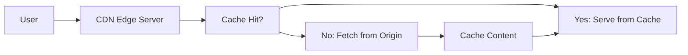

# Content Delivery Network (CDN)

A Content Delivery Network (CDN) is a geographically distributed network of servers that work together to provide fast delivery of internet content. CDNs minimize latency by serving content from locations closer to users, improving website performance and user experience.

## What is a CDN?

### Definition
A Content Delivery Network (CDN) is a system of distributed servers that deliver web content and applications to users based on their geographic location. Instead of serving content from a single origin server, CDNs cache and deliver content from the server closest to the user.

### Key Components
- **Edge Servers**: Distributed servers at network edges
- **Origin Server**: Source of original content
- **Points of Presence (PoPs)**: Data centers with edge servers
- **CDN Control Plane**: Management and configuration system

### How CDN Works
1. **Content Upload**: Origin server pushes content to CDN
2. **DNS Resolution**: User's DNS query returns closest edge server
3. **Content Request**: User requests content from edge server
4. **Cache Check**: Edge server checks if content is cached
5. **Content Delivery**: Serve from cache or fetch from origin
6. **Analytics**: Track performance and usage metrics

## Benefits of CDN

### Performance Benefits
- **Reduced Latency**: Content served from nearby servers
- **Faster Load Times**: Parallel downloads from multiple servers
- **Bandwidth Savings**: Reduced load on origin servers
- **Improved Throughput**: Handle more concurrent users

### User Experience Benefits
- **Global Reach**: Fast content delivery worldwide
- **Reliability**: Redundant infrastructure prevents outages
- **Scalability**: Handle traffic spikes automatically
- **Mobile Optimization**: Optimized for mobile networks

### Business Benefits
- **Cost Reduction**: Lower bandwidth and infrastructure costs
- **SEO Improvement**: Faster sites rank better
- **Conversion Rates**: Better performance increases conversions
- **Competitive Advantage**: Superior user experience

## CDN Architecture

### Pull CDN
Content is pulled from origin server on-demand.

**How it works:**
1. User requests content from edge server
2. Edge server checks cache for content
3. If not cached, fetches from origin server
4. Content cached at edge for future requests
5. Subsequent requests served from cache

**Advantages:**
- **Automatic**: No content pre-positioning needed
- **Storage Efficient**: Only popular content cached
- **Simple**: Minimal configuration required

**Disadvantages:**
- **First Request Latency**: Cold cache hit takes longer
- **Origin Load**: Popular content causes origin traffic spikes
- **Cache Miss Rate**: Higher for unpopular content

### Push CDN
Content is proactively pushed to edge servers.

**How it works:**
1. Content creator uploads to CDN
2. CDN distributes to all or selected edge servers
3. Edge servers have content ready for users
4. No cache misses for pushed content

**Advantages:**
- **Consistent Performance**: No cache misses
- **Predictable**: Guaranteed content availability
- **Origin Offload**: No traffic to origin servers

**Disadvantages:**
- **Storage Cost**: All content stored everywhere
- **Update Complexity**: Updating content requires re-pushing
- **Cost**: More expensive for large content libraries

### Hybrid CDN
Combines pull and push approaches.

**Strategy:**
- **Static Content**: Push to ensure availability
- **Dynamic Content**: Pull for freshness
- **Popular Content**: Push to hot PoPs
- **Unpopular Content**: Pull on-demand

## CDN Caching Strategies

### Cache Hit Ratio
Percentage of requests served from cache.

**Factors Affecting Hit Ratio:**
- **Content Popularity**: Popular content has higher hit ratios
- **Cache Size**: Larger cache holds more content
- **TTL Settings**: Longer TTL increases hits but reduces freshness
- **User Behavior**: Geographic distribution affects local hits

### Cache Control Headers

#### Cache-Control Header
Directives for caching behavior.

```http
Cache-Control: max-age=3600, public, s-maxage=7200
```

**Common Directives:**
- `max-age`: Browser cache duration (seconds)
- `s-maxage`: CDN cache duration
- `public`: Cacheable by any cache
- `private`: Cacheable only by browser
- `no-cache`: Revalidate before using
- `no-store`: Don't cache

#### Other Caching Headers
- **ETag**: Entity tag for conditional requests
- **Last-Modified**: Content modification timestamp
- **Expires**: Absolute expiration time
- **Vary**: Different versions for different clients

### Cache Invalidation
Removing outdated content from cache.

**Methods:**
- **Time-Based**: TTL expiration
- **Manual**: API calls to purge specific content
- **Tag-Based**: Purge content by tags
- **Version-Based**: Update version in URL

## CDN Performance Optimization

### Content Optimization
- **Compression**: Gzip, Brotli for text content
- **Minification**: Remove whitespace from code
- **Image Optimization**: WebP format, responsive images
- **Resource Hints**: Preload, prefetch directives

### Network Optimization
- **HTTP/2**: Multiplexing and header compression
- **QUIC**: Faster connection establishment
- **IPv6 Support**: Better address space utilization
- **Edge Computing**: Process content at edge

### Monitoring and Analytics
- **Real-Time Metrics**: Request rates, response times
- **Geographic Analytics**: Performance by region
- **Cache Performance**: Hit ratios, miss rates
- **Error Tracking**: 4xx/5xx error analysis

## CDN Security Features

### DDoS Protection
- **Traffic Filtering**: Block malicious traffic
- **Rate Limiting**: Prevent abuse
- **Bot Detection**: Identify and block bots
- **Web Application Firewall**: Protect against attacks

### SSL/TLS Support
- **Custom Certificates**: Use your own SSL certificates
- **Let's Encrypt**: Automatic certificate provisioning
- **Certificate Pinning**: Prevent certificate spoofing
- **Perfect Forward Secrecy**: Enhanced security

### Access Control
- **Token Authentication**: Secure content access
- **IP Whitelisting**: Restrict access by IP
- **Referrer Checking**: Prevent hotlinking
- **Signed URLs**: Time-limited access

## CDN Providers

### Major CDN Providers

#### Cloudflare
- **Features**: DDoS protection, WAF, DNS
- **Pricing**: Free tier available
- **Strengths**: Security, developer tools

#### Akamai
- **Features**: Largest network, enterprise focus
- **Pricing**: Enterprise pricing
- **Strengths**: Global reach, customization

#### Fastly
- **Features**: Real-time purging, edge computing
- **Pricing**: Pay-as-you-go
- **Strengths**: Developer-friendly, instant updates

#### AWS CloudFront
- **Features**: Deep AWS integration, Lambda@Edge
- **Pricing**: Usage-based
- **Strengths**: Scalability, cost optimization

#### Google Cloud CDN
- **Features**: Global network, AI optimization
- **Pricing**: Usage-based
- **Strengths**: Intelligence, automation

### Choosing a CDN

#### Factors to Consider
- **Coverage**: Geographic distribution
- **Performance**: Latency reduction, throughput
- **Cost**: Pricing model, data transfer costs
- **Features**: Security, analytics, customization
- **Integration**: With existing infrastructure
- **SLA**: Uptime guarantees, support

## CDN Implementation

### Basic Setup
1. **Sign up with CDN provider**
2. **Configure origin server**
3. **Set up DNS to point to CDN**
4. **Configure caching rules**
5. **Test and monitor**

### DNS Configuration
```dns
; Point domain to CDN
example.com.     IN  CNAME   d1.example.cloudfront.net.

; Or use CDN nameservers
NS records point to CDN provider
```

### CDN Configuration
```javascript
// Example CloudFront distribution config
{
  "CallerReference": "example-distribution",
  "Origins": {
    "Items": [{
      "DomainName": "origin.example.com",
      "Id": "origin1"
    }]
  },
  "DefaultCacheBehavior": {
    "TargetOriginId": "origin1",
    "ViewerProtocolPolicy": "redirect-to-https",
    "CachePolicyId": "cache-policy-id"
  }
}
```

## CDN in System Design

### Static Content Delivery


### API Acceleration
- **Global API Endpoints**: Reduce latency for global users
- **Response Caching**: Cache API responses
- **Request Optimization**: Compress and optimize requests

### Video Streaming
- **Adaptive Bitrate**: Adjust quality based on connection
- **Edge Encoding**: Transcode video at edge locations
- **Live Streaming**: Real-time content delivery

### E-commerce Optimization
- **Product Images**: Fast loading of product catalogs
- **Checkout Acceleration**: Speed up conversion funnel
- **Personalization**: Edge-side personalization

## CDN Challenges and Solutions

### Cache Consistency
**Challenge:** Ensuring cached content is up-to-date
**Solutions:**
- Appropriate TTL settings
- Cache invalidation strategies
- Versioned content URLs

### Cost Management
**Challenge:** Unpredictable costs with usage spikes
**Solutions:**
- Cost monitoring and alerts
- Usage optimization
- Reserved capacity planning

### Security Trade-offs
**Challenge:** Balancing performance with security
**Solutions:**
- Layered security approach
- CDN-specific security features
- Regular security audits

## Advanced CDN Concepts

### Edge Computing
Running compute at CDN edge locations.

**Use Cases:**
- **API Processing**: Run serverless functions at edge
- **Content Transformation**: Modify content based on user context
- **Real-time Analytics**: Process data close to users
- **IoT Data Processing**: Handle IoT device data at edge

### Multi-CDN Strategy
Using multiple CDN providers simultaneously.

**Benefits:**
- **Redundancy**: Failover between providers
- **Cost Optimization**: Route to cheapest provider
- **Performance**: Choose best performing provider per region
- **Vendor Lock-in Avoidance**: Not dependent on single provider

### CDN Interconnection
Direct connections between CDNs for better performance.

**Examples:**
- ** peering agreements** between CDN providers
- **Content exchange points** for efficient content sharing
- **Private interconnections** for enterprise customers

## Monitoring CDN Performance

### Key Metrics
- **Cache Hit Ratio**: Percentage of requests served from cache
- **Response Time**: Time to serve content
- **Bandwidth Usage**: Data transfer costs
- **Error Rates**: 4xx/5xx response codes
- **Availability**: Uptime percentage

### Tools
- **CDN Analytics**: Built-in provider dashboards
- **Real User Monitoring**: Track actual user experience
- **Synthetic Monitoring**: Simulate user requests
- **Log Analysis**: Detailed request/response logs

## CDN Best Practices

### Content Strategy
- **Cache-Friendly Content**: Design for caching
- **Versioning**: Use versioned URLs for updates
- **Compression**: Enable compression for text content
- **Optimization**: Optimize images and assets

### Configuration
- **TTL Strategy**: Balance freshness with performance
- **Purge Strategy**: Efficient cache invalidation
- **Security Rules**: Appropriate security configurations
- **Monitoring Setup**: Comprehensive monitoring and alerts

### Cost Optimization
- **Right-sizing**: Choose appropriate CDN tier
- **Usage Monitoring**: Track and optimize usage patterns
- **Caching Optimization**: Maximize cache hit ratios
- **Compression**: Reduce data transfer costs

## CDN vs Other Technologies

### CDN vs Reverse Proxy
- **Scope**: CDN is globally distributed, reverse proxy is single location
- **Use Case**: CDN for global content delivery, reverse proxy for application protection
- **Caching**: Both cache, but CDN caches globally

### CDN vs Cloud Storage
- **Purpose**: CDN delivers content, cloud storage stores it
- **Performance**: CDN optimized for delivery speed
- **Integration**: Cloud storage can be origin for CDN

### CDN vs DNS
- **Function**: DNS translates names to IPs, CDN delivers content
- **Integration**: DNS can route to optimal CDN PoP
- **Performance**: Both improve performance but differently

## Future of CDN

### Emerging Trends
- **Serverless at Edge**: Run code at CDN edge
- **AI/ML Integration**: Intelligent content optimization
- **5G Integration**: Optimized for high-speed mobile networks
- **IoT Support**: Handle massive IoT device connections
- **WebAssembly**: Run complex applications at edge

### Challenges Ahead
- **Privacy Regulations**: GDPR, CCPA compliance
- **Net Neutrality Changes**: Impact on CDN operations
- **Sustainability**: Energy-efficient data centers
- **Quantum Computing**: Future encryption challenges

## Conclusion

CDNs are essential for modern web applications, providing fast, reliable content delivery worldwide. They improve performance, reduce costs, and enhance user experience by bringing content closer to users.

**Key Takeaways:**
- CDNs reduce latency through geographic distribution
- Choose between pull, push, or hybrid caching strategies
- Consider security, cost, and performance when selecting a provider
- Implement proper cache control and invalidation strategies
- Monitor performance and optimize configurations regularly

Understanding CDN fundamentals and best practices is crucial for designing high-performance, globally distributed systems.
