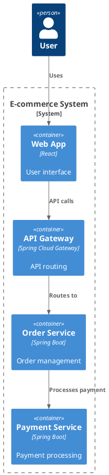

# System Design Architecture Diagrams

This directory contains visual diagrams and architecture illustrations for system design concepts. These diagrams complement the text content in the main repository and provide visual learning aids.

## 📊 Available Diagrams

### Core System Architecture
- **microservices_architecture.md** - Microservices decomposition patterns
- **load_balancing_patterns.md** - Load balancing algorithms and strategies
- **database_sharding.md** - Database sharding and partitioning strategies
- **caching_architecture.md** - Caching patterns and architectures
- **cdn_global_distribution.md** - Content delivery network architectures

### Distributed Systems
- **cap_theorem_visualization.md** - CAP theorem trade-offs visualization
- **consistency_models.md** - Different consistency models in distributed systems
- **leader_election_algorithms.md** - Leader election and consensus algorithms
- **distributed_locking.md** - Distributed locking patterns

### Messaging & Event-Driven
- **message_queue_patterns.md** - Message queue architectures and patterns
- **event_driven_architecture.md** - Event-driven system architectures
- **stream_processing_topology.md** - Stream processing pipeline architectures

### Scalability & Performance
- **auto_scaling_architectures.md** - Auto-scaling patterns and implementations
- **rate_limiting_patterns.md** - Rate limiting algorithms and architectures
- **circuit_breaker_patterns.md** - Circuit breaker implementation patterns

### Real-World Case Studies
- **instagram_architecture.md** - Instagram's system architecture
- **twitter_architecture.md** - Twitter/X system architecture
- **netflix_architecture.md** - Netflix streaming architecture

## 🎯 How to Use These Diagrams

### For Learning
1. **Study the diagrams** alongside the corresponding text content
2. **Understand data flow** and component interactions
3. **Identify patterns** and architectural decisions
4. **Compare alternatives** and trade-off considerations

### For Presentations
1. **Use in interviews** to explain system designs visually
2. **Create architecture documentation** for projects
3. **Present design decisions** to stakeholders
4. **Document system evolution** and changes

### For Reference
1. **Quick visual recall** of system design patterns
2. **Architecture templates** for new projects
3. **Pattern recognition** in existing systems
4. **Design validation** against best practices

## 🛠 Creating Diagrams

These diagrams are created using:

### Text-Based Diagrams (ASCII/Markdown)
```
┌─────────────┐    ┌─────────────────┐    ┌─────────────┐
│   Client    │────│   API Gateway   │────│   Service   │
└─────────────┘    └─────────────────┘    └─────────────┘
```

### PlantUML (for complex diagrams)


### Drawing Tools
- **Excalidraw** - Free, collaborative drawing tool
- **Draw.io** - Professional diagramming
- **Lucidchart** - Enterprise diagramming
- **Miro** - Collaborative whiteboarding

## 🤝 Contributing

### Adding New Diagrams
1. **Create ASCII/Markdown diagrams** for simple architectures
2. **Use consistent notation** and styling
3. **Include clear labels** and descriptions
4. **Add usage examples** and explanations
5. **Reference real systems** where possible

### Diagram Guidelines
1. **Keep it simple** - Focus on key components and data flow
2. **Use consistent colors** - Follow established color schemes
3. **Include legends** - Explain symbols and notations
4. **Add scale indicators** - Show relative sizes/volumes
5. **Version control** - Track diagram changes with repository

## 📚 Related Resources

- **System Design Patterns** - Main repository content
- **Case Studies** - Real-world architecture examples
- **Interview Preparation** - Practice problems and solutions
- **Additional Resources** - Books, courses, and tools

---

**Visual learning makes complex systems easier to understand!** 📊

*These diagrams help bridge the gap between theoretical concepts and practical implementation.*
